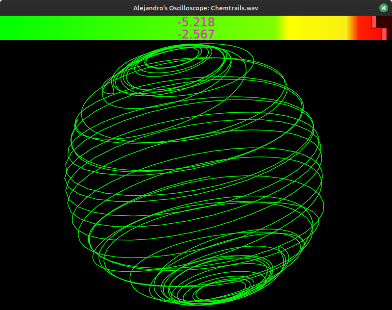

# Alejandro's Oscilloscope

## Overview
Just screwing around with [LÖVE's](love2d.org) powerful [soundData](https://love2d.org/wiki/SoundData) sample manipulation

### To do:
- real time microphone input

### Dependencies
- [moonshine](https://github.com/vrld/moonshine)
- [srt.lua](https://github.com/alejandro-alzate/srt-lua)

### How to run
If you know you can skip this chapter.
If there's no releases in the release page that means that either i had no time or just couldn't be bothered
But is [simple to run this](https://love2d.org/wiki/Game_Distribution) follow the following steps:
- Download the code, press the green button at the top called "code" you might not see it in that case zoom out or maximize your window, it's github's fault not mine
- If you haven't already install [love](love2d.org) in your machine, and follow their steps as well
- I personally highly recommend adding love to the path variable if you're in windows
- Press download zip
- Decompress the file

- Approach 1:
	- Now compress the *files and folders* **within** the "master" folder and **not** the master folder itself
	- Rename from .zip to .love (For windows you might have to check "Show file extensions" to see the .zip part)
	- Just double click the .love you just created file.

- Approach 2:
	- go inside the master folder and open a terminal
		- Windows press F4 in the file explorer and write cmd
		If you followed correctly this should work:
			- `"C:\Program Files\LOVE\lovec.exe" .`

		- Linux just right click and press `Open in Terminal` most distros have it
			- and just type `love .` much easier than windows eh?

### Usage
Drop any audio file that love2d can handle mp3 wav ogg etc
Additionally you can drop a .srt (a captions file) if the audio has it,
it automatically will get in sync

### Key combos
- Visuals:
	- `F1`: Show Performance
	- `F2`: Use Shaders
	- `F3`: Show VU meter
	- `F4`: Show Captions
	- `F5`: Restart application
	- `Shift + F4`: Clear captions file
- Playback:
	- `space`:		Play pause
	- `left`:		Seek backwards by 5 seconds
	- `right`:		Seek forwards by 5 seconds
	- `up`:			Increase volume
	- `down`:		Decrease volume
	- `Shift + ,`:	Decrease playback speed
	- `Shift + .`:	Increase playback speed

### Demo

